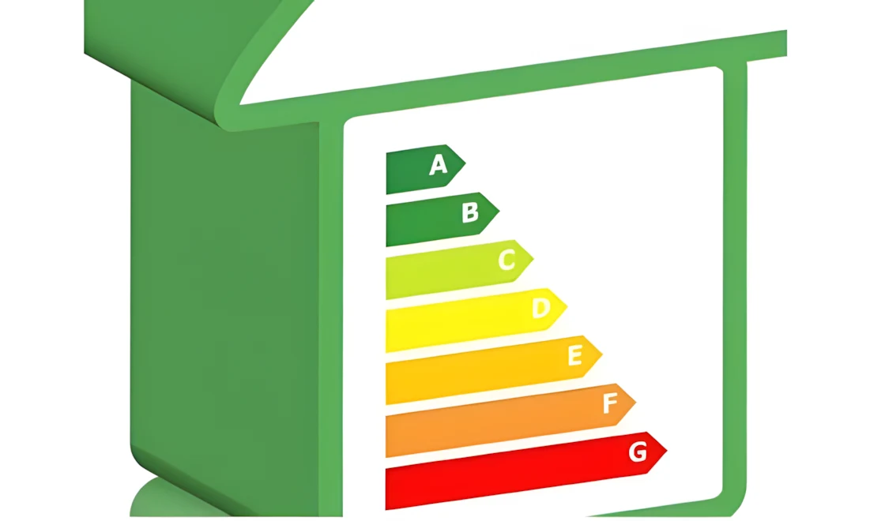

В настоящее время правильный выбор кондиционера имеет большое значение для повышения комфорта и экономии энергии. Однако на рынке существует множество моделей кондиционеров, и выбрать правильную модель среди такого множества опций может быть сложно. В этом руководстве мы пошагово рассмотрим, на что следует обращать внимание при выборе устройства, которое подходит именно вам.

## Знакомство с типами кондиционеров

Перед выбором кондиционера необходимо понять различные типы кондиционеров, доступных на рынке. Вот самые распространенные типы и их особенности:

- **Настенные кондиционеры:** Популярны благодаря стильному дизайну и легкости установки, часто используются в жилых помещениях и небольших офисах.  
- **Напольные кондиционеры:** Обладают высокой мощностью охлаждения и подходят для больших помещений.  
- **Кассетные кондиционеры:** Устанавливаются в потолок и равномерно распределяют воздух, идеально подходят для крупных офисов или коммерческих помещений.  
- **Консольные кондиционеры:** Устанавливаются на уровне пола, легко использовать в ограниченных пространствах.  
- **Канальные кондиционеры:** Обеспечивают скрытую распределение воздуха по всему помещению, обычно используются в гостиницах и больших зданиях.  
- **Потолочные кондиционеры:** Устанавливаются под потолок, часто используются в ресторанах или конференц-залах.  
- **Мобильные кондиционеры:** Мобильные, что позволяет использовать их в разных комнатах.  
- **VRF системы:** Идеальны для крупных коммерческих зданий и сложных проектов, обеспечивая высокую энергоэффективность.  

### Какой тип подходит именно вам?
- **Жилые помещения:** Настенные или напольные кондиционеры — идеальный выбор.  
- **Офисы и коммерческие помещения:** Можно выбрать кассетные или канальные кондиционеры.  
- **Часто переезжающие:** Мобильные кондиционеры могут быть хорошим вариантом.

Кроме того, можно выбрать идеальный тип кондиционера, учитывая различные параметры. Например, при выборе типа кондиционера следует обратить внимание на высоту потолка в помещении, количество окон, уровень солнечного света и другие факторы.

## Учитывайте особенности помещения

При выборе кондиционера важно учитывать характеристики помещения, в котором будет использоваться устройство. Вот несколько факторов, которые следует принимать во внимание:

### Размер помещения
При определении мощности кондиционера нужно учитывать размер помещения. Общие рекомендации:  
- **Для помещений площадью 10-20 м²:** 9.000 BTU  
- **Для помещений площадью 20-40 м²:** 12.000-18.000 BTU  
- **Для помещений площадью 40 м² и более:** модели мощностью 24.000 BTU и выше  

### Высота потолков и изоляция
- В помещениях с высокими потолками или плохой изоляцией может потребоваться более мощный кондиционер.  
- В помещениях с хорошей изоляцией можно обойтись кондиционером с меньшей мощностью.  

### Солнечное освещение и количество окон
- В помещениях, где много солнечного света, нагрузка на охлаждение увеличивается.  
- В помещениях с большими стеклянными поверхностями может потребоваться увеличение мощности для оптимизации энергопотребления.

## Энергоэффективность и экологичные варианты

Энергоэффективность и внимание к охране окружающей среды — важные факторы при выборе кондиционера.

### Энергетический класс
Кондиционер класса A+++  
- Снижает потребление энергии и помогает сократить счета за электроэнергию.  
- Менее вреден для окружающей среды, уменьшает углеродный след.  

### Экологичные хладагенты
- **R32 и R410A:** Эти хладагенты известны своей экологичностью и высокой энергоэффективностью.

### Долгосрочная экономия
Энергоэффективный кондиционер может быть дороже на старте, но в долгосрочной перспективе сэкономит вам деньги на электроэнергии.

## Советы и рекомендации

Чтобы выбрать подходящий кондиционер, следуйте этим советам:

- **Уровень шума:** Для спальни и офисов выбирайте модели с низким уровнем шума.  
- **Дополнительные функции:** Wi-Fi, таймер и функция очистки воздуха могут повысить ваш комфорт.  
- **Обслуживание и гарантия:** Выбирайте устройства с легким обслуживанием и длительной гарантией.

## Заключение

Правильный выбор кондиционера не только повысит ваш комфорт, но и обеспечит энергосбережение и экологичность. Выбирая кондиционер с подходящей мощностью, энергетическим классом и типом для вашего помещения, вы улучшите качество своей жизни. С правильным выбором вы сможете снизить расходы на энергетику и получить устройство, которое будет служить вам долгое время.

---

**Часто задаваемые вопросы**

### Какой фактор наиболее важен при выборе кондиционера?  
Размер помещения, мощность кондиционера и энергоэффективность — это самые важные факторы.

### Какой тип кондиционера подходит для больших офисов?  
Кассетные и канальные кондиционеры — идеальные решения для больших офисов.

### Мобильные кондиционеры эффективны?  
Они могут быть эффективными для небольших помещений и краткосрочного использования, однако их энергоэффективность обычно ниже, чем у стационарных моделей.

### Что такое экологичный кондиционер?  
Экологичные кондиционеры используют хладагенты, которые потребляют меньше энергии и не наносят ущерба окружающей среде.

### Как выбрать кондиционер с низким уровнем шума?  
При выборе кондиционера обратите внимание на уровень шума устройства в децибелах (дБ). Модели с уровнем шума 30 дБ или ниже работают тихо.

### Какие марки кондиционеров более надежны?  
Надежными считаются марки с длительной гарантией и положительными отзывами от пользователей.
