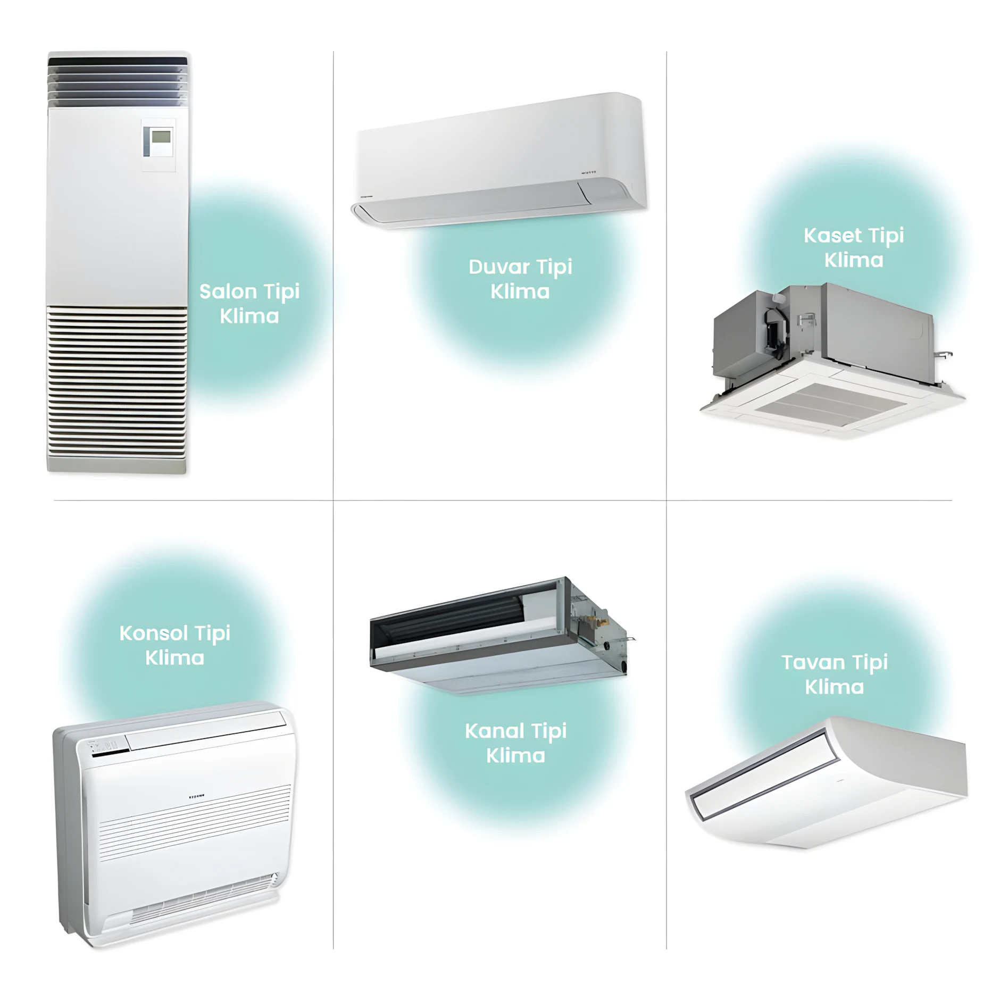
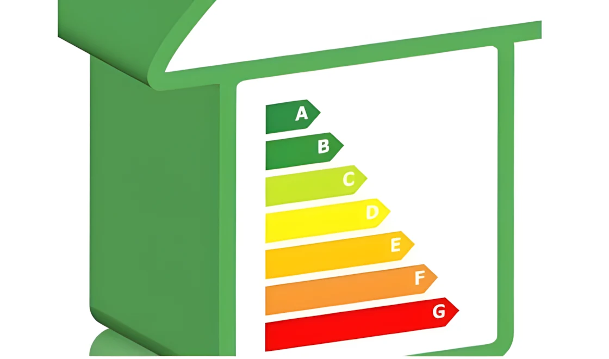

Günümüzde doğru klima seçimi yapmak, hem konforunuzu artırmak hem de enerji tasarrufu sağlamak açısından büyük önem taşır. Ancak piyasada birçok klima modeli bulunuyor ve bu kadar seçenek arasında doğru kararı vermek zor olabilir. Bu rehberde, ihtiyaçlarınıza en uygun cihazı seçerken dikkat etmeniz gereken noktaları adım adım ele alacağız.

## Klima Türlerini Tanıyın

Klima seçiminizi yapmadan önce piyasada bulunan farklı klima türlerini anlamanız gerekir. İşte en yaygın klima türleri ve özellikleri:

- **Duvar Tipi Klimalar:** Şık tasarımı ve kolay kurulumu sayesinde konutlarda ve küçük ofislerde en çok tercih edilen modellerdir.  
- **Salon Tipi Klimalar:** Yüksek soğutma kapasitesi sunar ve geniş mekanlar için uygundur.  
- **Kaset Tipi Klimalar:** Tavan içine monte edilir ve hava akımını eşit şekilde dağıtarak büyük ofisler veya ticari alanlar için idealdir.  
- **Konsol Tipi Klimalar:** Zemin seviyesine monte edilir ve özellikle dar alanlarda kullanımı kolaydır.  
- **Kanal Tipi Klimalar:** Tüm alanlara gizli bir şekilde hava dağıtımı sağlar, genellikle otellerde ve büyük binalarda tercih edilir.  
- **Tavan Tipi Klimalar:** Tavanın altına monte edilir ve genellikle restoranlar veya toplantı odaları gibi alanlar için uygundur.  
- **Mobil Klimalar:** Taşınabilir olduğu için farklı odalarda kullanılabilir.  
- **VRF Sistemleri:** Büyük ticari binalar ve kompleks projeler için ideal olup yüksek enerji verimliliği sağlar.  

### Hangi Tür Sizin İçin Daha Uygun?
- **Konutlar:** Duvar tipi veya salon tipi klimalar idealdir.  
- **Ofisler ve Ticari Mekanlar:** Kaset tipi veya kanal tipi klimalar tercih edilebilir.  
- **Sık Taşınanlar:** Mobil klimalar uygun bir seçenek olabilir.

Ek olarak çeşitli değerlendirmelere göre de en ideal klima türünü seçilebilir. Örneğin, klima türü seçerken mekanın tavan yüksekliği, pencere sayısı, güneş ışığına maruz kalma durumu gibi faktörler göz önünde bulundurulabilir.

## Mekanın Özelliklerini Dikkate Alın

Doğru klima seçimi yaparken, cihazın kullanılacağı mekanın özelliklerini dikkate almak büyük önem taşır. İşte göz önünde bulundurmanız gereken bazı faktörler:

### Mekanın Büyüklüğü
Klimanın kapasitesini belirlerken odanın büyüklüğünü göz önünde bulundurmalısınız. Genel kılavuz:  
- **10-20 m² alanlar için:** 9.000 BTU  
- **20-40 m² alanlar için:** 12.000-18.000 BTU  
- **40 m² ve üzeri:** 24.000 BTU ve üzeri kapasiteli modeller  

### Tavan Yüksekliği ve İzolasyon
- Yüksek tavanlı veya kötü yalıtımlı mekanlarda daha güçlü bir klimaya ihtiyaç duyabilirsiniz.  
- İzolasyonu iyi bir mekanda, daha düşük kapasiteli bir klima yeterli olabilir.  

### Güneş Işığı ve Pencere Sayısı
- Güneş ışığına maruz kalan odalarda soğutma yükü artar.  
- Büyük cam yüzeylere sahip alanlarda enerji tüketimini optimize etmek için kapasiteyi artırmanız gerekebilir.

## Enerji Verimliliği ve Çevre Dostu Seçenekler

Enerji verimliliği ve çevreye duyarlılık, doğru klima seçimi yaparken dikkate alınması gereken önemli faktörlerdir.

### Enerji Sınıfı
A+++ enerji sınıfına sahip bir klima:  
- Daha düşük enerji tüketimiyle faturalarınızı azaltır.  
- Çevreye daha az zarar verir, karbon ayak izinizi küçültür.  

### Çevre Dostu Gazlar
- **R32 ve R410A:** Bu gazlar, çevre dostu olmaları ve yüksek enerji verimliliği sağlamalarıyla bilinir.

### Uzun Vadeli Tasarruf
Enerji verimli bir klima başlangıçta daha pahalı olabilir ancak uzun vadede elektrik tasarrufuyla maliyetini amorti eder.

## İpuçları ve Öneriler

İhtiyacınıza uygun bir klima seçmek için şu ipuçlarını takip edebilirsiniz:

- **Sessizlik Seviyesi:** Yatak odaları ve ofisler için düşük ses seviyesine sahip modelleri tercih edin.  
- **Ek Özellikler:** Wi-Fi bağlantısı, zamanlayıcı ve hava temizleme özellikleri konforunuzu artırabilir.  
- **Bakım ve Garanti:** Kolay bakım imkanı sunan ve uzun garanti süresine sahip ürünleri seçin.

## Sonuç

Doğru klima seçimi, konforunuzun yanı sıra enerji tasarrufu ve çevre dostu bir yaşam tarzı sağlar. Mekanınıza uygun kapasitede, enerji sınıfında ve türde bir klima seçerek yaşam kalitenizi artırabilirsiniz. İhtiyacınıza uygun bir seçimle hem enerji maliyetlerinizi düşürebilir hem de uzun yıllar kullanabileceğiniz bir yatırım yapabilirsiniz.

---

**Sıkça Sorulan Sorular**

### Klima seçerken en önemli faktör nedir?  
Mekanın büyüklüğü, klima kapasitesi ve enerji verimliliği en önemli faktörlerdir.

### Hangi klima türü büyük ofisler için uygundur?  
Kaset tipi ve kanal tipi klimalar büyük ofisler için ideal çözümler sunar.

### Mobil klimalar verimli midir?  
Küçük alanlarda ve kısa süreli kullanımlarda verimli olabilir, ancak enerji tüketimi genellikle sabit modellere göre daha yüksektir.

### Çevre dostu klima ne demektir?  
Çevre dostu klimalar, daha az enerji tüketen ve çevreye zarar vermeyen soğutucu gazlar kullanan cihazlardır.

### Sessiz çalışan bir klima nasıl seçilir?  
Klima alırken cihazın dB (desibel) seviyesine dikkat edin. 30 dB veya daha düşük modeller sessiz çalışma sunar.

### Hangi markalar daha güvenilir?  
Garanti süresi uzun olan ve kullanıcı yorumlarında olumlu geri dönüşler alan markalar güvenilir olarak kabul edilir.
