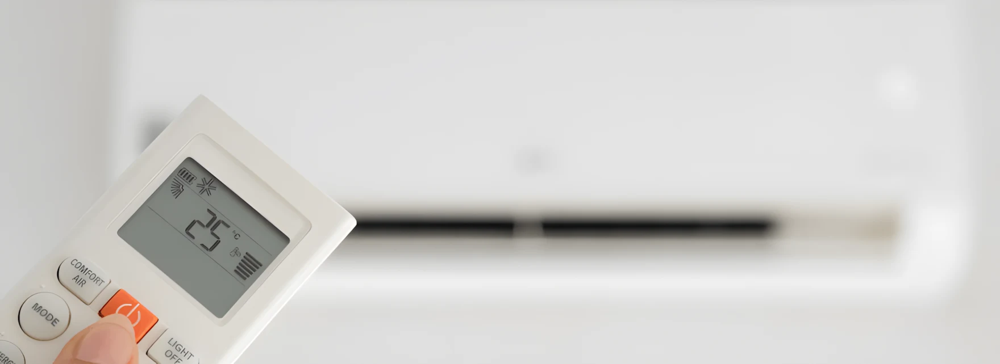
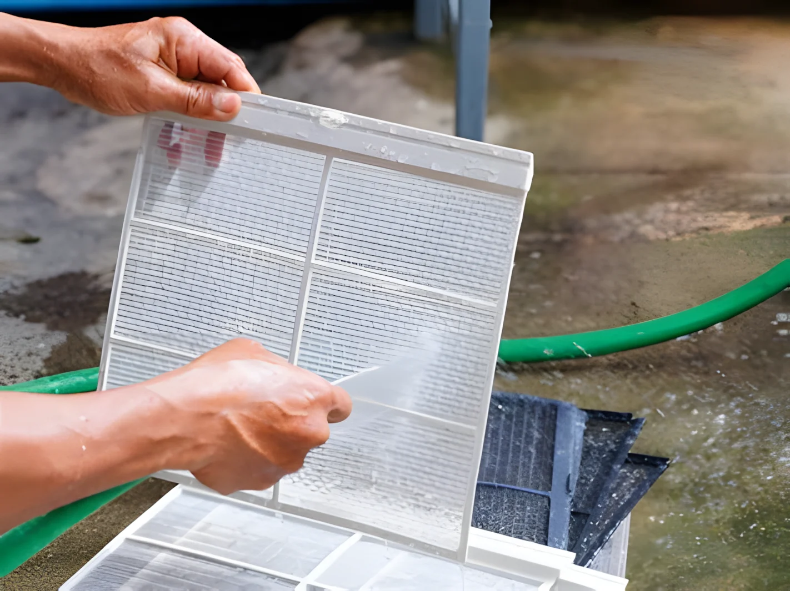

# Proper Air Conditioner Use in Summer: Health and Savings Tips

During hot summer days, air conditioners are essential for cooling our living spaces. However, improper use can negatively impact both your health and energy costs. By using your air conditioner correctly and selecting the right model, you can avoid these issues while enjoying comfort and savings. Knowing the differences between inverter and standard air conditioners can also help you choose the right device for your needs.

## Optimal Temperature Settings

Setting the right temperature is crucial for efficient and healthy operation of your air conditioner during summer:

- **Ideal temperature range:** Set your air conditioner between 22-26°C (72-78°F). This range provides comfortable cooling and minimizes energy consumption.
- **Avoid low temperatures:** Settings below 20°C (68°F) increase energy consumption and the risk of catching a cold.
- **Use night mode:** This feature consumes less energy and maintains an ideal temperature throughout the night.

## Energy-Saving Tips

You can save energy and reduce your bills by taking small precautions during air conditioner use:

- **Block sunlight:** Use blinds, shades, or curtains to keep your room cooler.
- **Seal your space:** Keep doors and windows closed to prevent cooled air from escaping.
- **Clean filters regularly:** Dirty filters make your air conditioner work harder, consuming more energy. Clean them monthly to improve efficiency.

## Health Considerations

Proper use of air conditioners can keep you cool and healthy during summer:

- **Avoid direct airflow:** Prevent air from blowing directly on you, as it can cause muscle aches, headaches, and respiratory issues.
- **Maintain humidity balance:** Use the dehumidification mode to keep indoor humidity levels between 40-60%.
- **Ensure air circulation:** Open windows occasionally to allow fresh air to enter.

## Maintenance and Cleaning

Regular maintenance is essential for optimal performance and health benefits. Here's what to focus on:

- **Filter cleaning:** Clean or replace filters monthly to ensure efficient operation and clean air circulation.
- **Professional maintenance:** Schedule a professional check-up once a year to enhance overall performance and prevent breakdowns.
- **Outdoor unit cleaning:** Remove dust and debris from the outdoor unit to optimize airflow.

## Conclusion and Summary

By using your air conditioner properly during summer, you can save energy and create a healthy environment. Maintaining a temperature range of 22-26°C, performing regular maintenance, and considering the advantages of inverter models can make the process more efficient. With the right habits, staying cool, economical, and comfortable during summer is achievable!

---

**Frequently Asked Questions**

### Does an inverter air conditioner really use less energy?

Yes, inverter air conditioners optimize motor speed, reducing energy consumption.

### What is the ideal temperature setting for summer?

A setting between 22-26°C (72-78°F) ensures energy savings and a healthy environment.

### Why are standard air conditioners more affordable?

Standard air conditioners use simpler technology, making them generally less expensive.

### How often should air conditioner maintenance be done?

Clean filters monthly and have a professional service it annually.

### What does the dehumidification mode do?

It balances indoor humidity levels, creating a more comfortable living space.

### Should I choose an inverter or a standard air conditioner?

For long-term use and energy savings, go for an inverter air conditioner. For short-term use and a lower budget, standard models may suffice.
