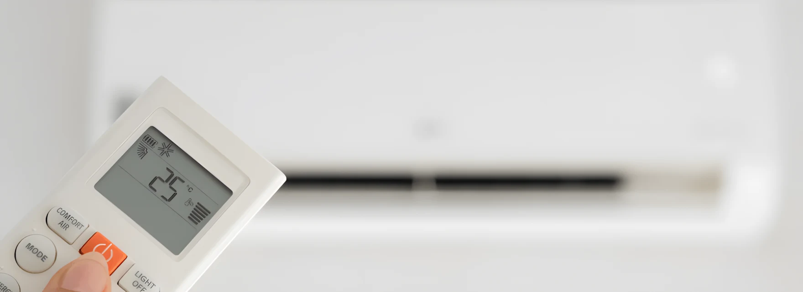
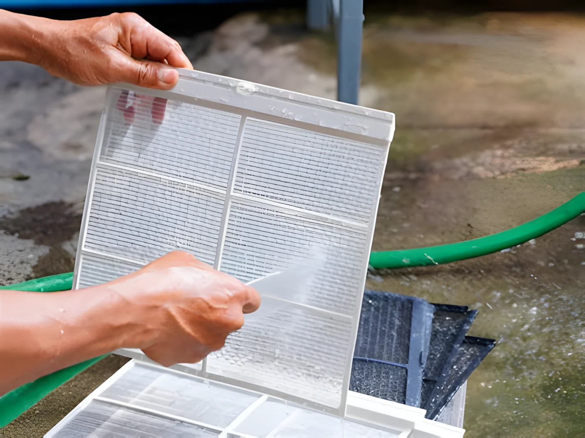

# Правильное использование кондиционеров летом: советы для здоровья и экономии

В жаркие летние дни кондиционеры незаменимы для охлаждения наших жилых помещений. Однако неправильное использование может негативно сказаться как на вашем здоровье, так и на расходах на электроэнергию. Используя кондиционер правильно и выбирая подходящую модель, вы сможете избежать этих проблем, сохраняя комфорт и экономию. Знание различий между инверторными и обычными кондиционерами поможет вам выбрать устройство, соответствующее вашим потребностям.

## Оптимальные настройки температуры

Выбор правильной температуры очень важен для эффективной и безопасной работы кондиционера летом:

- **Идеальный диапазон температуры:** Установите кондиционер на 22-26°C. Этот диапазон обеспечивает комфортное охлаждение и минимизирует энергопотребление.
- **Избегайте низких температур:** Настройки ниже 20°C увеличивают расход энергии и риск простуды.
- **Используйте ночной режим:** Эта функция снижает энергопотребление и поддерживает идеальную температуру всю ночь.

## Советы по экономии энергии

Простые меры при использовании кондиционера помогут вам сэкономить энергию и снизить счета:

- **Блокируйте солнечный свет:** Используйте шторы, жалюзи или занавески, чтобы сохранять помещение прохладным.
- **Держите помещение герметичным:** Закрывайте двери и окна, чтобы охлажденный воздух не выходил.
- **Регулярно очищайте фильтры:** Забитые фильтры заставляют кондиционер работать интенсивнее, потребляя больше энергии. Чистите их раз в месяц.

## Учет влияния на здоровье

Правильное использование кондиционера позволяет не только охладиться, но и сохранить здоровье летом:

- **Избегайте прямого потока воздуха:** Не допускайте, чтобы поток воздуха дул прямо на вас, так как это может вызвать мышечные боли, головные боли и проблемы с дыханием.
- **Поддерживайте уровень влажности:** Используйте режим осушения, чтобы поддерживать уровень влажности в пределах 40-60%.
- **Обеспечьте циркуляцию воздуха:** Время от времени открывайте окна для притока свежего воздуха.

## Обслуживание и чистка кондиционера

Регулярное обслуживание кондиционера важно для его эффективной работы и вашего здоровья. Обратите внимание на следующее:

- **Чистка фильтров:** Чистите или заменяйте фильтры раз в месяц, чтобы обеспечить эффективную работу и циркуляцию чистого воздуха.
- **Профессиональное обслуживание:** Проводите профессиональное обслуживание один раз в год для повышения производительности и предотвращения поломок.
- **Чистка наружного блока:** Удаляйте пыль и мусор с наружного блока, чтобы оптимизировать поток воздуха.

## Заключение и итог

Используя кондиционеры правильно летом, вы можете сэкономить энергию и создать здоровую среду. Поддержание температуры в пределах 22-26°C, регулярное обслуживание и использование преимуществ инверторных моделей помогут сделать этот процесс более эффективным. С правильными привычками вы сможете наслаждаться прохладой, экономией и комфортом в жаркие дни!

---

**Часто задаваемые вопросы**

### Действительно ли инверторные кондиционеры потребляют меньше энергии?

Да, инверторные кондиционеры оптимизируют скорость работы мотора, снижая потребление энергии.

### Какая температура является оптимальной летом?

Температура в пределах 22-26°C обеспечивает экономию энергии и комфортные условия.

### Почему обычные кондиционеры дешевле?

Обычные кондиционеры используют более простую технологию, поэтому их стоимость ниже.

### Как часто нужно обслуживать кондиционер?

Чистить фильтры следует раз в месяц, а профессиональное обслуживание проводить раз в год.

### Для чего нужен режим осушения?

Он регулирует уровень влажности в помещении, делая его более комфортным.

### Какой кондиционер выбрать: инверторный или обычный?

Для длительного использования и экономии энергии лучше выбрать инверторный кондиционер. Для кратковременного использования и ограниченного бюджета подойдут обычные модели.
