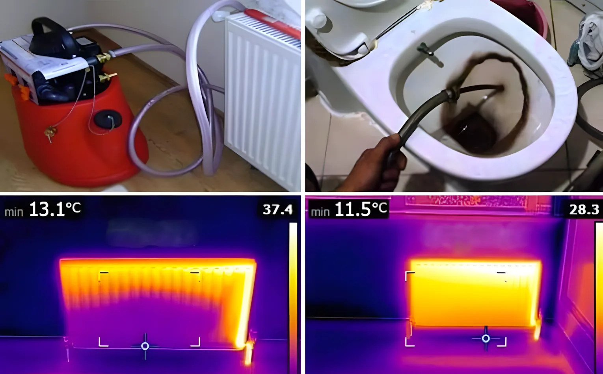

Регулярное **обслуживание кондиционеров и котлов** важно для энергосбережения, продления срока службы устройств и создания здоровой жилой среды. В этой статье мы рассмотрим, почему обслуживание так необходимо, его преимущества и советы по поддержанию оптимальной работы оборудования.

## Энергосбережение и эффективность

Одним из ключевых преимуществ регулярного обслуживания кондиционеров и котлов является повышение их энергоэффективности. Поддерживаемые устройства:

- Потребляют меньше энергии, что снижает расходы на электричество и газ.
- Работают эффективнее, быстрее достигая нужной температуры воздуха или воды.
- Помогают сократить энергопотери, способствуя сохранению окружающей среды.

### Статистика по энергосбережению

Исследования показывают, что плохо обслуживаемые кондиционеры могут потреблять на 15% больше энергии. Для котлов этот показатель может достигать 20%.

## Продление срока службы

Пренебрежение регулярным обслуживанием может сократить срок службы кондиционеров и котлов. Однако регулярный уход дает следующие преимущества:

- **Снижение износа:** Чистка фильтров, вентиляторов и трубок уменьшает нагрузку на компоненты, обеспечивая их бесперебойную работу.
- **Сокращение затрат на ремонт:** Регулярное обслуживание помогает выявлять потенциальные проблемы до их перерастания в дорогостоящие поломки.
- **Сохранение инвестиций:** Вместо покупки нового оборудования вы сможете пользоваться текущим устройством долгие годы.

## Влияние на здоровье

Обслуживание кондиционеров и котлов важно не только для их работы, но и для здоровья. Вот почему:

- **Улучшение качества воздуха:** Грязные фильтры могут быть источником бактерий и плесени, что провоцирует заболевания дыхательной системы.
- **Контроль влажности и плесени:** Регулярное обслуживание кондиционеров предотвращает избыточную влажность и рост плесени.
- **Предотвращение утечек угарного газа:** Неисправные котлы могут выделять угарный газ — опасный и потенциально смертельный.

## График и рекомендации по обслуживанию

Не уверены, как часто нужно проводить обслуживание? Вот что вам нужно знать:

### Когда обслуживать кондиционеры

- **Не реже одного раза в год:** Желательно до начала летнего сезона.
- **После интенсивного использования:** По окончании лета, если устройство работало без перерывов.

### Когда обслуживать котлы

- **Перед зимой:** Проверка осенью обеспечит оптимальную работу в холодное время года.
- **Регулярные проверки:** Годовое обслуживание продлевает срок службы устройства и поддерживает его эффективность.

### Что включает обслуживание

- Чистка фильтров
- Проверка вентиляторов
- Выявление утечек газа
- Регулировка давления воды

## Технические советы и рекомендации

### Советы по обслуживанию кондиционеров

1. **Чистка фильтров:** Регулярно очищайте фильтры, чтобы повысить качество воздуха и эффективность системы.
2. **Проверка внешнего блока:** Удалите мусор и пыль с внешнего блока для улучшения воздушного потока.

### Советы по обслуживанию котлов

1. **Контроль давления воды:** Поддерживайте идеальное давление в пределах 1,5–2 бар для оптимальной работы.
2. **Чистка радиаторов:** Регулярная чистка радиаторов помогает равномерно распределять тепло.

## Заключение

Обслуживание кондиционеров и котлов не только продлевает срок их службы, но и помогает экономить на энергозатратах и предотвращает угрозы для здоровья. Запланировав регулярное обслуживание, вы обеспечите комфорт, безопасность и эффективность вашего дома.

---

## Часто задаваемые вопросы

### Сколько времени занимает обслуживание кондиционера?

Обычно обслуживание занимает 1–2 часа в зависимости от состояния устройства.

### Когда лучше всего проводить обслуживание котла?

Рекомендуется проводить обслуживание осенью, перед началом зимы.

### Дорого ли обходится обслуживание?

Стоимость зависит от типа и состояния устройства, но регулярное обслуживание обходится дешевле, чем ремонт.

### Могут ли неисправные кондиционеры вызывать проблемы со здоровьем?

Да, грязные фильтры и вентиляционные каналы могут содержать аллергены и бактерии, провоцирующие заболевания дыхательной системы.

### Можно ли самостоятельно обслуживать котел?

Вы можете выполнять базовые задачи, такие как проверка давления, но для полноценного обслуживания требуется профессиональный техник.

### Почему нужно регулярно обслуживать технику?

Регулярное обслуживание повышает энергоэффективность, продлевает срок службы устройства и предотвращает угрозы для здоровья.
